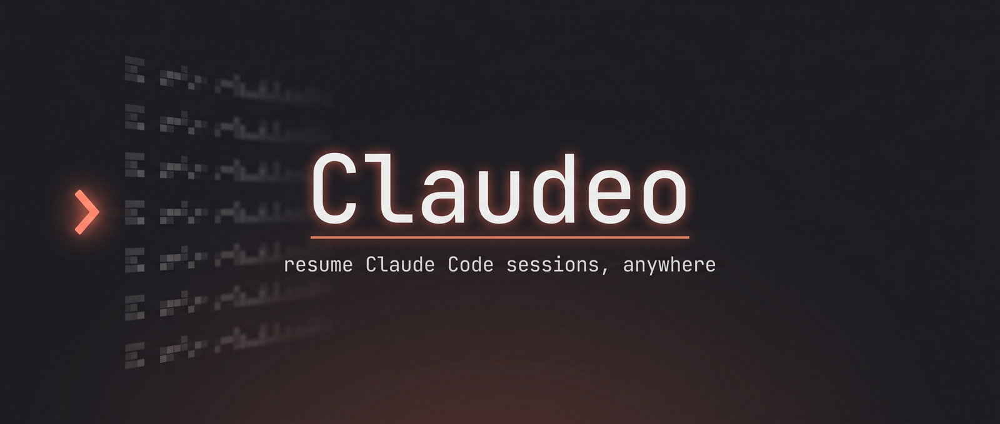

<p align="center">
  
</p>

<p align="center">
  <b>An interactive terminal picker to resume <a href="https://claude.com/claude-code">Claude Code</a> sessions across every directory.</b><br>
  Type <code>co</code>, filter to a project, pick a session — it <code>cd</code>s there and runs <code>claude --resume</code>.
</p>

<p align="center">
  
  
  
</p>

---

Claude Code scatters your sessions across one folder per working directory. When you
want to pick up where you left off, you have to remember *which* directory, `cd` there,
and find the right `--resume` id. **Claudeo** collapses all of that into one command:
a fuzzy, two-step picker over **every** resumable session on your machine.

## Demo

A type-to-filter picker in two steps — first the **project**, then the **session**:

```
  claudeo  104 sessions · 15 projects

? Search projects  weig
❯   4m  weight-tracker-pro   9 sessions
   1d  TheBall              3 sessions
  W:\Personal\WeightTrackerPro\Repo\weight-tracker-pro
↑↓ navigate • ⏎ select • esc quit
```

```
? Sessions in weight-tracker-pro
❯   4m  Fix the CI build error in github
   2h  Add a streak chart to the dashboard
   1d  Wire up the weigh-in reminder cron
↑↓ navigate • ⏎ select • esc back
```

Press **Esc** in the session list to pop back to the project list — your cursor lands
right back on the project you came from.

## Features

- 🔭 **Every session, one list** — walks all of `~/.claude/projects`, newest-first.
- ⌨️ **Type to filter** — a live search bar at each step (project name / path, then
  prompt text / session id).
- 🗂️ **Grouped by project** — sessions collapse under their working directory;
  case-variant paths (`W:\…` vs `w:\…`) merge into one.
- 💬 **Real prompt previews** — shows each session's first typed prompt, recovered
  straight from the transcript when the history log doesn't have it.
- 📂 **Actually changes directory** — a tiny shell function `cd`s your parent shell
  into the session's directory before resuming (a binary alone can't).
- 🪶 **Tiny & fast** — one small TypeScript binary, no telemetry, no config.

## Install

```bash
git clone https://github.com/b4n92uid/claudeo.git && cd claudeo
npm install
npm run link        # builds + registers the `claudeo` binary globally
```

Then add the `co` shell function so it can change your shell's directory:

```powershell
# PowerShell (primary)
claudeo shell-init pwsh | Add-Content $PROFILE ; . $PROFILE
```

```bash
# bash
claudeo shell-init bash >> ~/.bashrc && source ~/.bashrc
```

> **Why a shell function?** A child process can't change its parent shell's working
> directory. The `claudeo` binary renders the picker and writes the chosen
> `<cwd>` + `<sessionId>` to a temp file; the `co` function reads it, `cd`s **your
> shell** into that directory, then runs `claude --resume` — so when you exit Claude,
> your shell is left in the project. Run `claudeo` bare and it still resumes the
> session in its own directory, but as a child process, so your shell returns to where
> it started once Claude exits.

## Usage

```bash
co              # pick a session → cd into its dir + claude --resume
co -a           # include every session (default: newest 40)
co -n 100       # cap the list at N
claudeo         # resume directly, without leaving your shell in the project dir
```

| Key | Action |
|-----|--------|
| `type` | filter the current list |
| `↑` / `↓` | move the cursor |
| `⏎` | select |
| `Esc` | go back a step (quit from the project list) |
| `Ctrl+C` | cancel |

## How it works

Claude Code stores everything under `~/.claude/`:

- `projects/<encoded-dir>/<sessionId>.jsonl` — full transcripts (the ground truth of
  what's resumable).
- `history.jsonl` — a flat log of every typed prompt, with the canonical `cwd` and
  first prompt per session.

`claudeo` walks the transcript files, then enriches each session with its real working
directory and first prompt from `history.jsonl` — falling back to a single bounded read
of the transcript head when history doesn't have it. The real path always comes from a
`cwd`/`project` **field**, never from reversing the (lossy) folder name.

See [`CLAUDE.md`](CLAUDE.md) for the full architecture and the directory-encoding
details.

## Development

```bash
npm run build       # tsup → dist/cli.js (ESM, shebang)
npm run dev         # tsup --watch
node dist/cli.js    # run locally without linking
```

- **TypeScript, ESM, Node ≥18**, bundled with [tsup](https://tsup.egoist.dev/).
- Picker UI built on [`@inquirer/core`](https://github.com/SBoudrias/Inquirer.js)
  (`src/prompt.ts` — a custom type-to-filter select with an Esc keybinding).
- `picocolors` for color, `commander` for arg parsing.

## License

[MIT](LICENSE) © Abdelghani Beldjouhri
